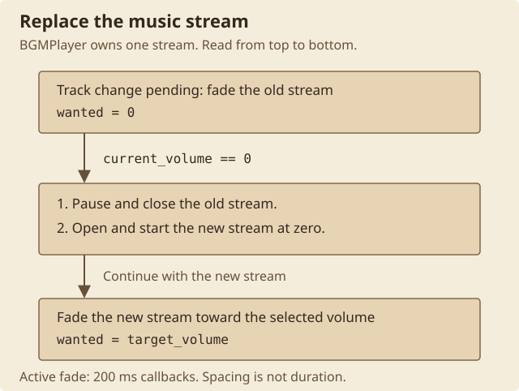

# Music

When the music changes, the old track becomes silent before the new track starts. The game fades out its single background stream, replaces it, and fades the new track in. It does not keep two music streams alive for a true crossfade.

## Files and names

Music is stored under `music/` as numbered files:

```text
music/1.mus
music/2.mus
...
music/64.mus
```

The game builds a logical path such as `.\music\12.mp3`. `audio_bgm_file_open` changes the last three characters to `mus` only when it opens the loose file. Miles still sees an MP3 name and decodes the bytes through `Mp3dec.asi`.

This explains the extension:

- `.mus` is not MIDI.
- `.mus` is not a custom container or encrypted file.
- Every matching `.mus` file examined is ordinary MP3 data.

## Matching asset set

| Property | Result |
| --- | --- |
| Tracks | 64, numbered 1 through 64 |
| Codec | MP3 for all 64 files |
| Sample rates | 11,025 Hz, 22,050 Hz, and 44,100 Hz |
| Common sample rate | 22,050 Hz on 54 tracks |
| Channels | 18 mono and 46 stereo |
| Bitrates | 32 through 160 kbit/s |
| Common bitrate | 64 kbit/s on 32 tracks |
| Duration | About 42.4 through 193.9 seconds |

Miles converts these sources to the shared 22,050 Hz, 16-bit, stereo output as needed.

## Playback

`audio_play_music_path` saves the requested path and passes it to `BGMPlayer`. The player opens one Miles stream, sets its loop count to `0`, sets its current volume, and starts it. The loop-count meaning belongs to Miles, but this path is used as the game's repeating background-music path.

Known producers include:

- `event_handle_intro_state`, which requests music 1.
- Minigame and pane code, which can select a numbered track or restore the previous path.
- [`SSoundEffect`](../network/server/025-0x19-sound-effect.md), whose `0xFF` form selects music from a server packet.

## Volume

The options pane shows music levels `0` through `10`. `audio_set_music_volume_level` multiplies that level by `20` and stores the result in the player's one-byte target volume.

```text
saved or UI level:  0 .. 10
Miles target:       level * 20
default level:      3
default target:     60
```

The setter does not clamp the value itself. The normal options pane supplies the `0` through `10` limit.

## Fade timer

The player lowers the old stream's volume to zero before replacing it. The new stream starts at zero and rises toward the selected volume. The transition therefore has two fades with a stream replacement between them.

<figure class="diagram">
<div class="diagram-scroll" role="region" tabindex="0" aria-label="Music replacement diagram; scroll horizontally on narrow screens">

</div>
<figcaption><span class="diagram-hint">Scroll sideways to read the whole diagram.</span>Music replacement is an ordered sequence, not a fixed-duration timeline. Active fades use 200 ms callbacks; the volume rule below determines each step. <a href="../assets/diagrams/music-replacement.svg">Open the full-size diagram</a>.</figcaption>
</figure>

`audio_bgm_timer_callback` runs through the shared event timer system every 200 ms while a fade is active. `audio_bgm_transition_tick` moves the current volume toward its target:

```c
wanted = track_change_pending ? 0 : target_volume
difference = wanted - current_volume

if (abs(difference) >= 10)
    current_volume += difference / 5
else
    current_volume = wanted
```

Each callback closes about one fifth of the remaining gap while that gap is at least ten volume units. A smaller gap snaps to the target. This makes the fade slow as it approaches the target; it is not a constant change in volume per tick.

At the default target of `60`, one side of the fade takes roughly two seconds. The 200 ms callback cadence is separate from that approximate duration. There is no overlap between the old and new streams.
